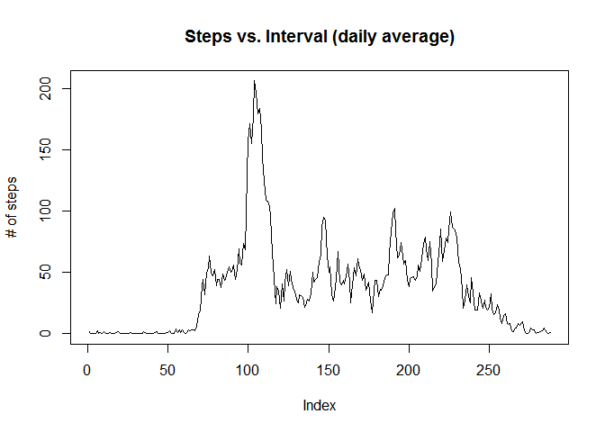
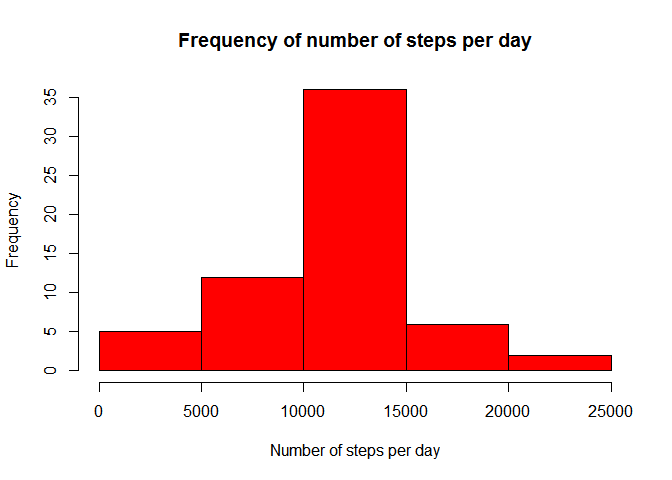
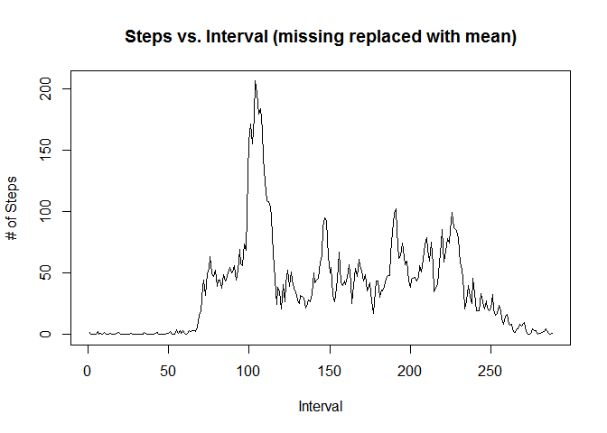
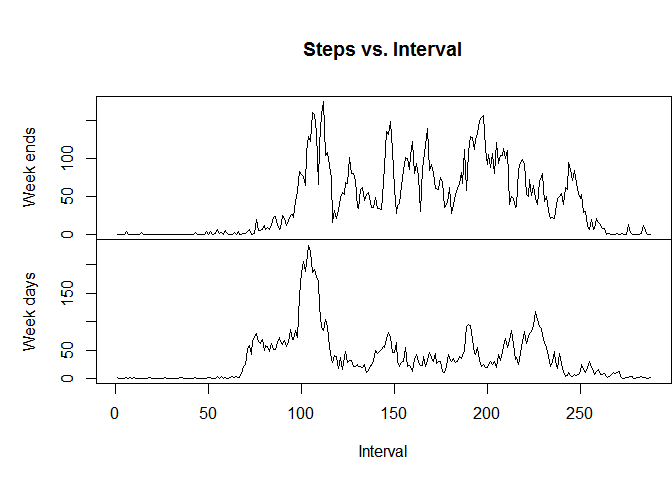

# Reproducible Research: Peer Assessment 1


## Loading and preprocessing the data

```r
setwd("C:/Users/jomalsjohn/Documents")
data <- read.csv("activity.csv")
```

## What is mean total number of steps taken per day?

```r
stepsTotalPerDay <- tapply(data$steps, data$date, sum)
hist(stepsTotalPerDay, breaks = 6, main = "Frequency of number of steps per day", 
    xlab = "Number of steps per day", ylab = "Frequency", col = "red")
```

 

```r
stepsMeanPerDay <- tapply(data$steps, data$date, mean, na.rm = T)
stepsMedianPerDay <- tapply(data$steps,data$date,median,na.rm=T)

mean(stepsTotalPerDay, na.rm = T)
```

```
## [1] 10766.19
```

```r
median(stepsTotalPerDay, na.rm = T)
```

```
## [1] 10765
```


## What is the average daily activity pattern?


```r
stepsMeanPerInterval <- tapply(data$steps, data$interval, mean, na.rm = T)
plot(stepsMeanPerInterval, type = "l", main = ("Steps vs. Interval (daily average)"), 
    ylab = "# of steps")
```

 

```r
seq(along = stepsMeanPerInterval)[stepsMeanPerInterval == max(stepsMeanPerInterval)]
```

```
## [1] 104
```

## Imputing missing values


```r
sum(as.numeric(is.na(data$steps)))
```

```
## [1] 2304
```

```r
# Get the steps mean per interval as a vector
tmp_stepsMeanPerInterval <- as.vector(stepsMeanPerInterval)
# Repeat it to be the same for each of the 61 days
tmp_stepsMeanPerInterval <- rep(tmp_stepsMeanPerInterval, 61)
# Set it one where there is no missin data
tmp_stepsMeanPerInterval[!is.na(data$steps)] = 1

# Get the steps data as a vector
tmp_dataTest <- as.vector(data$steps)
# Set it to one where data is missing
tmp_dataTest[is.na(tmp_dataTest)] = 1

data_NoMissing <- data
data_NoMissing$steps <- tmp_stepsMeanPerInterval * tmp_dataTest


# stepsMeanPerDay_NoMissing <-
# tapply(data_NoMissing$steps,data_NoMissing$date,mean,na.rm=T)
# stepsMedianPerDay_NoMissing <-
# tapply(data_NoMissing$steps,data_NoMissing$date,median,na.rm=T)

stepsTotalPerDay_NoMissing <- tapply(data_NoMissing$steps, data_NoMissing$date, 
    sum)
hist(stepsTotalPerDay_NoMissing, breaks = 6, main = "Frequency of number of steps per day", 
    xlab = "Number of steps per day", ylab = "Frequency", col = "red")
```

 

```r
stepsMeanPerInterval_NoMissing <- tapply(data_NoMissing$steps, data_NoMissing$interval, 
    mean)
mean(stepsTotalPerDay_NoMissing)
```

```
## [1] 10766.19
```

```r
median(stepsTotalPerDay_NoMissing)
```

```
## [1] 10766.19
```

```r
plot(stepsMeanPerInterval_NoMissing, type = "l", xlab = "Interval", ylab = "# of Steps", 
    main = "Steps vs. Interval (missing replaced with mean)")
```

 


## Are there differences in activity patterns between weekdays and weekends?

```r
# Create a factor variable with two levels (weekday, weekend-day)
tmpLT <- as.POSIXlt(data$date, format = "%Y-%m-%d")
tmpWeekDays <- tmpLT$wday
tmpWeekDays[tmpWeekDays == 0] = 0
tmpWeekDays[tmpWeekDays == 6] = 0
tmpWeekDays[tmpWeekDays != 0] = 1
tmpWeekDaysFactor <- factor(tmpWeekDays, levels = c(0, 1))
# Add the factor variable to the data
data$WD <- tmpWeekDaysFactor
# Calculate the mean
stepsMeanPerWeekday <- tapply(data$steps, list(data$interval, data$WD), mean, 
    na.rm = T)

par(mfrow = c(2, 1))
# Display the 2 plots
with(data, {
    par(mai = c(0, 1, 1, 0))
    plot(stepsMeanPerWeekday[, 1], type = "l", main = ("Steps vs. Interval"), 
        xaxt = "n", ylab = "Week ends")
    title = ("# of Steps v.s. Interval")
    par(mai = c(1, 1, 0, 0))
    plot(stepsMeanPerWeekday[, 2], type = "l", xlab = "Interval", ylab = "Week days")

})
```

 
